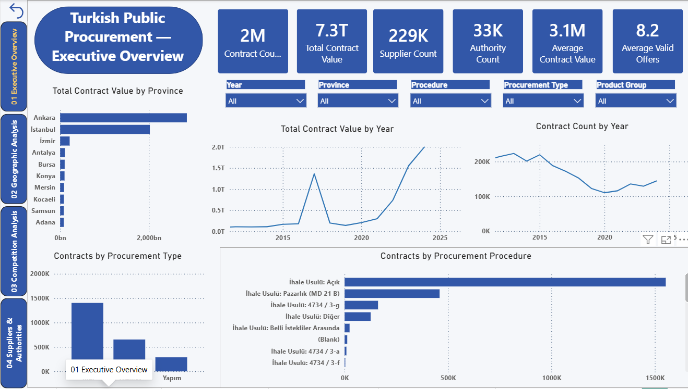
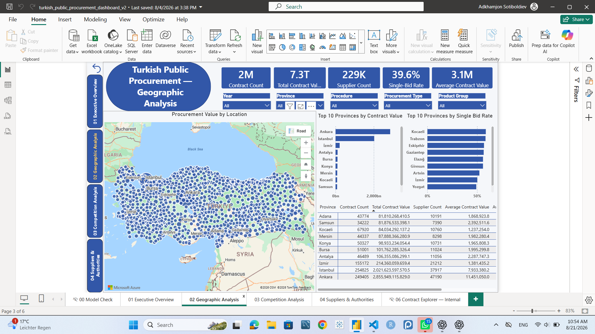
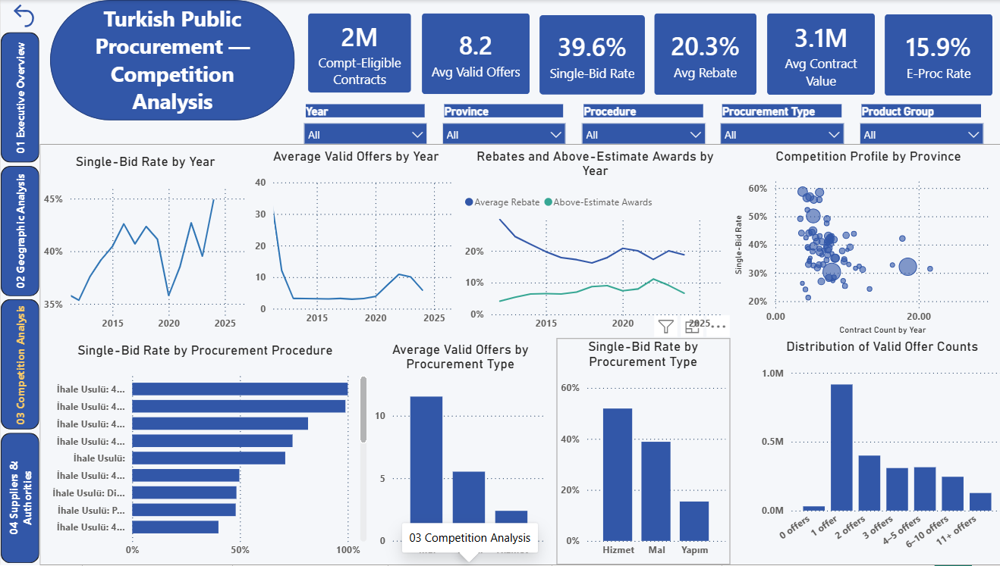
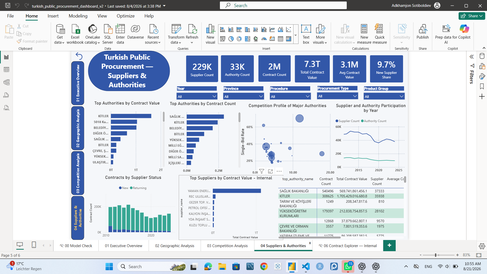
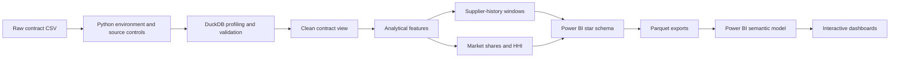
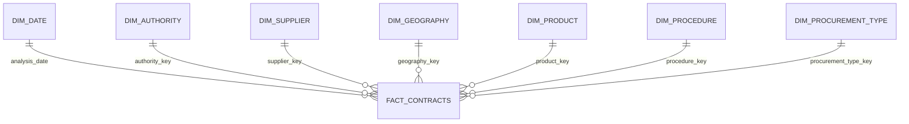

# Turkish Public Procurement Intelligence

An end-to-end business intelligence portfolio project that transforms 2.37 million Turkish public-procurement contract records into a validated analytical model and interactive Power BI report.

The project demonstrates practical work across Python, DuckDB SQL, data quality, dimensional modeling, DAX, geospatial validation, and dashboard design. Source and processed datasets are intentionally excluded from this repository.



## Project overview

The pipeline starts with a large contract-level CSV and builds the analytical tables required for procurement-market exploration. The main questions include:

- How have contract activity and value changed over time?
- How do procurement outcomes differ across provinces, procedures, and product groups?
- Where are single-bid awards and weak competition more prevalent?
- Which authorities and suppliers account for the largest shares of activity?
- How concentrated are province-year-product markets?

The analysis covers the intended 2010–2024 reporting period. Records outside that range remain available for validation but are excluded from public-facing analytical pages.

## Dashboard preview

### Executive overview

National KPIs, yearly trends, province rankings, procurement types, and procedures.


### Geographic analysis

Validated province/district geography, coordinate-based mapping, procurement value, and geographic competition indicators.



### Competition analysis

Valid-offer patterns, single-bid rates, rebates, above-estimate awards, and comparisons across procedures and locations.



### Suppliers and authorities

Authority scale, supplier participation, supplier status, competition profiles, and internal supplier-value rankings.



This screenshot is included as a portfolio preview because supplier names are visible in the report page. The underlying PBIX and row-level model remain private. The contract-level explorer is not published because it contains detailed identifiers and records.

## Architecture



## Technical highlights

### DuckDB SQL

- Schema, null, blank, distinct-value, and conversion profiling
- Safe typing with `TRY_CAST`, `NULLIF`, and multi-format date parsing
- Explicit row-grain and duplicate validation
- Window functions for prior supplier wins and buyer-supplier histories
- Market-level supplier shares and Herfindahl-Hirschman Index calculations
- Star-schema construction with deterministic dimension records
- Foreign-key, row-count, date-range, and export reconciliation checks

The executable workflow is in [`notebooks/procurement_project.ipynb`](notebooks/procurement_project.ipynb). Curated SQL extracts are in [`scripts/sql/`](scripts/sql/).

### Power BI

- One-to-many star-schema relationships with single-direction filtering
- Dedicated date dimension and controlled time intelligence
- Explicit DAX measures rather than implicit aggregations
- Synchronized slicers, page navigation, drillthrough, and internal/public page separation
- Geographic name validation and representative latitude/longitude coordinates
- Portfolio pages for overview, geography, competition, and authorities/suppliers

See [`docs/powerbi/dashboard-guide.md`](docs/powerbi/dashboard-guide.md), [`docs/powerbi/semantic-model.md`](docs/powerbi/semantic-model.md), and [`docs/powerbi/dax-measures.md`](docs/powerbi/dax-measures.md).

## Analytical model

The detailed fact table contains 2,370,736 source rows and connects to reusable dimensions for date, authority, supplier, geography, product, procedure, and procurement type.



Market-concentration outputs use a separate year × province × OKAS2 grain and are not joined directly to the detailed fact table.

## Repository structure

```text
.
├── docs/
│   ├── images/                  # Public-safe dashboard screenshots
│   ├── powerbi/                 # Model, dashboard, DAX, and disclosure notes
│   ├── disclosure_register.csv
│   ├── environments.md
│   └── source_register.md
├── notebooks/
│   └── procurement_project.ipynb
├── scripts/
│   ├── python/
│   └── sql/                     # Curated DuckDB SQL portfolio
├── .gitignore
├── requirements.txt
└── requirements-lock.txt
```

Local-only directories such as `data/`, `excel/`, `.env`, and Power BI binaries are excluded by `.gitignore`.

## Reproduce the analytical pipeline

### 1. Clone and create an environment

```powershell
git clone https://github.com/Adkhamjon66/turkish-public-procurement-bi.git
cd turkish-public-procurement-bi
python -m venv .venv
Set-ExecutionPolicy -Scope Process -ExecutionPolicy Bypass
.\.venv\Scripts\Activate.ps1
python -m pip install -r requirements.txt
```

### 2. Configure the local source

Create a local `.env` file that is never committed:

```dotenv
PROCUREMENT_RAW_CSV=D:/replace/with/local/path/merged_contract_level_2010_2024.csv
```

### 3. Run the notebook

Open `notebooks/procurement_project.ipynb`, select the `.venv` kernel, and run the cells in order. The notebook profiles the source, validates assumptions, creates analytical views, builds the star schema, and exports local Parquet tables.

The original dataset is required to reproduce the full outputs and is not redistributed here.

## Validation approach

The pipeline fails or pauses when core assumptions do not hold. Checks include:

- Expected source row count: 2,370,736
- Unique generated fact-row key
- Unique key on every dimension
- Raw-to-clean row-count preservation
- Safe conversion audits before permanent typing
- HHI bounds and market-grain checks
- Zero unmatched non-null foreign keys
- Independent read-back of every exported Parquet table
- Geography coordinate and match-quality validation

## Data access and disclosure

This repository does **not** contain:

- Raw procurement data
- Processed contract-level Parquet files
- Excel audit extracts
- Power BI `.pbix` files
- Environment files or machine-specific paths

The internal Power BI model embeds row-level data and therefore remains private. A future anonymous Power BI link will use a separate sanitized, aggregate-only semantic model. See [`docs/powerbi/public-disclosure.md`](docs/powerbi/public-disclosure.md).

## Tools

- Python 3.13
- DuckDB SQL
- pandas
- Jupyter
- Parquet
- Microsoft Power BI
- DAX
- Git and GitHub

## Project status

- Data preparation and validation: complete
- DuckDB analytical pipeline: complete
- Power BI star schema: complete
- Executive, geographic, competition, and supplier/authority dashboards: complete internally
- Public aggregate-only Power BI release: pending disclosure review

## Author

**Adkhamjon Sotiboldiev**
Data analytics and business intelligence portfolio project
