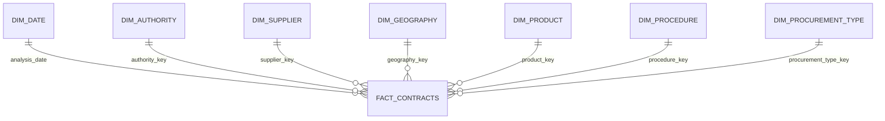

# Power BI semantic model

## Detailed contract star schema

## Relationship rules

| Dimension | Dimension key | Fact foreign key | Cardinality | Direction |
|---|---|---|---|---|
| `dim_date` | `date` | `analysis_date` | One-to-many | Single |
| `dim_authority` | `authority_key` | `authority_key` | One-to-many | Single |
| `dim_supplier` | `supplier_key` | `supplier_key` | One-to-many | Single |
| `dim_geography` | `geography_key` | `geography_key` | One-to-many | Single |
| `dim_product` | `product_key` | `product_key` | One-to-many | Single |
| `dim_procedure` | `procedure_key` | `procedure_key` | One-to-many | Single |
| `dim_procurement_type` | `procurement_type_key` | `procurement_type_key` | One-to-many | Single |

Every dimension key is unique, and all non-null foreign keys were validated against their dimension before export.

## Table grains

| Table | Grain |
|---|---|
| `fact_contracts` | One validated source award/contract row |
| `dim_date` | One calendar date |
| `dim_authority` | One generated authority key |
| `dim_supplier` | One standardized supplier key |
| `dim_geography` | One raw province/district combination mapped to a validated location |
| `dim_product` | One standardized product classification key |
| `dim_procedure` | One procedure/scope key |
| `dim_procurement_type` | One procurement type |
| `agg_market_year` | One year × province × OKAS2 market |

## Modeling safeguards

- No fact-to-fact relationship
- No bidirectional relationship
- No many-to-many relationship in the detailed star schema
- Date labels sorted using numeric month, quarter, and weekday columns
- Latitude and longitude categorized explicitly and set to `Do not summarize`
- Raw geographic names retained for audit; clean names used in reports
- Explicit measures used for counts, values, ratios, and rates

